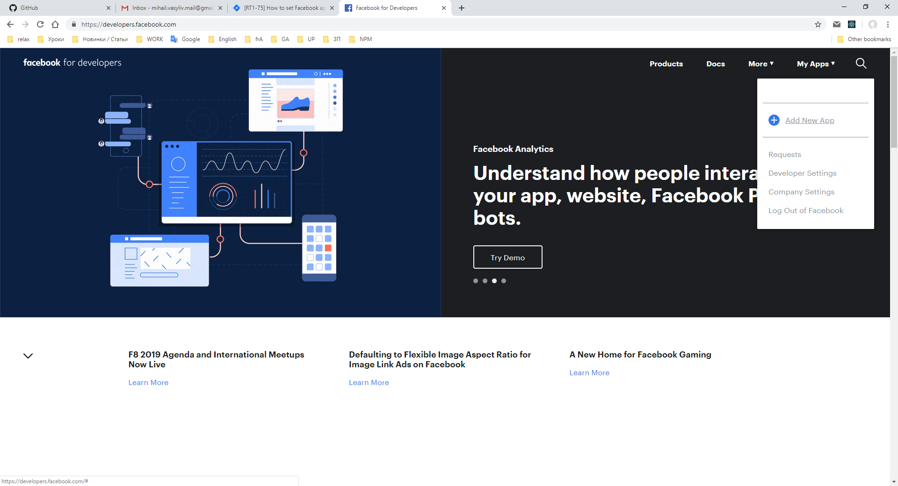
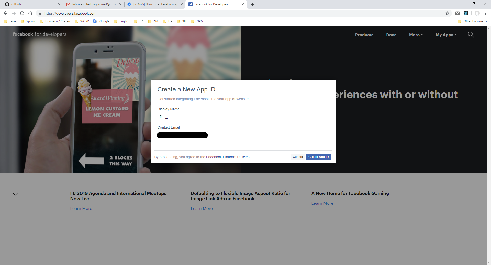
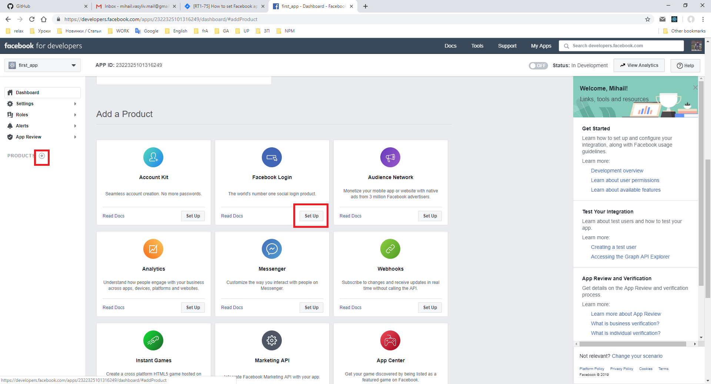
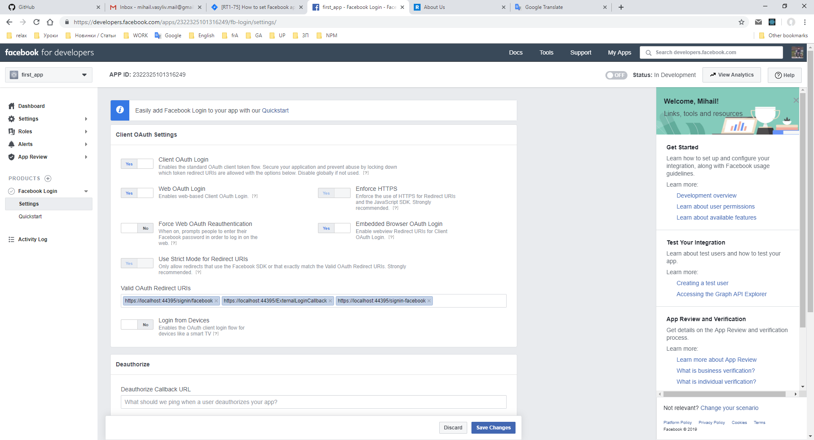
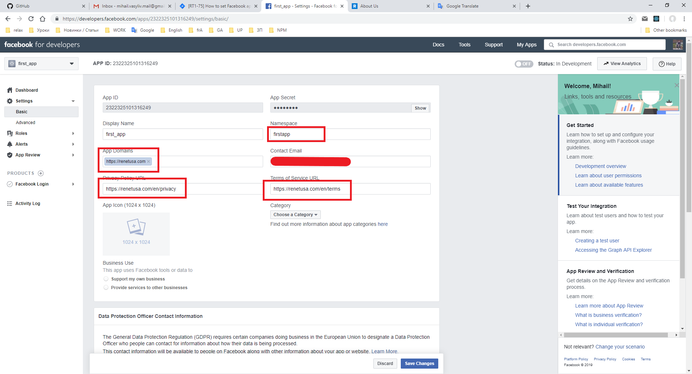
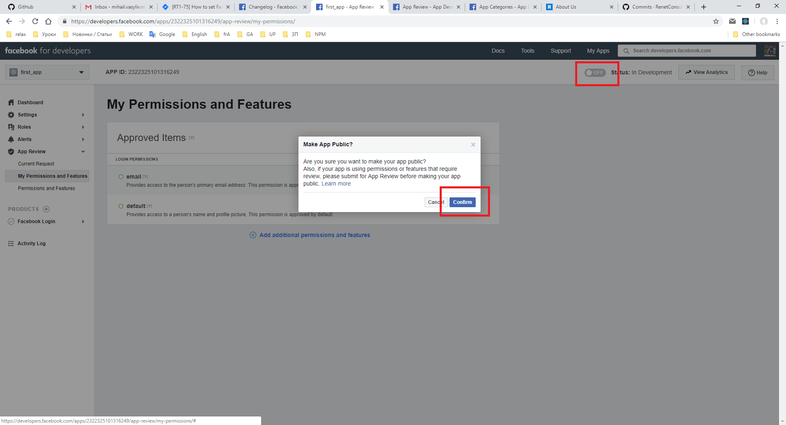

# First of all, you must have a facebook account. 
The first step (creating facebook app):
* Then navigate to https://developers.facebook.com/
* then click ``My apps``
 

 
* then click ``add new app``
 

 
* then click ``create app_id``
* then continue with captcha

# Second step:
Navigate to the created app dashboard
* then click to create a new product ``+``
 

 
there are a lot of types product but we will create a facebook login, so mouse *Facebook Login* and click on the button *set up*
* then go under ``Facebook login`` to ``settings``
make sure that all links will be present
 

 
* then click on the button ``save changes``

# The third step 
go to ``Settings`` tab under ``Basic``
fill next fields
 

 
 

 
choose a category (descriptions you can find there is https://developers.facebook.com/docs/apps/categories)

* then click save changes

Note:
{color:red}privacy and terms must be present{color}

If your app is using permissions or features that require review, please submit for App Review before making your app public.
Facebook provides access to few permissions and features without review, they are approved by default:
* email
* person's name
* profile picture
If you want more you should select permissions and get an approval.

# The last step
Check the slider button from off to on in the header menu:
 

 
* then click ``Confirm``
now your app is published.